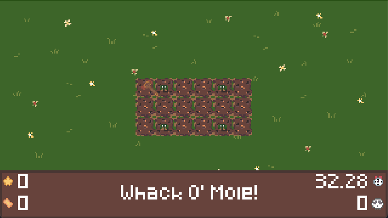

# Arcade Punch

Arcade Punch is a small, Whack A Mole style arcade game.

# Playing

## Web

Play it on [itch.io](https://hexedrevii.itch.io/arcade-punch)!

## Desktop

First, you need to download Love2D.
You can get it from [the website](https://love2d.org).

Next, download the .zip from the releases page and rename it to .love.

You can now double click it to launch the game, or drag it into the Love2D window!

## Mobile

Download the .zip from the releases page and rename it to .love.

Now, you can download a Love2D launcher to play the game.
For iOS, I recommend [Love2D Studio](https://apps.apple.com/ro/app/love2d-studio/id6474188075). It is free and can import .love files.

# License

GPL 3.0
